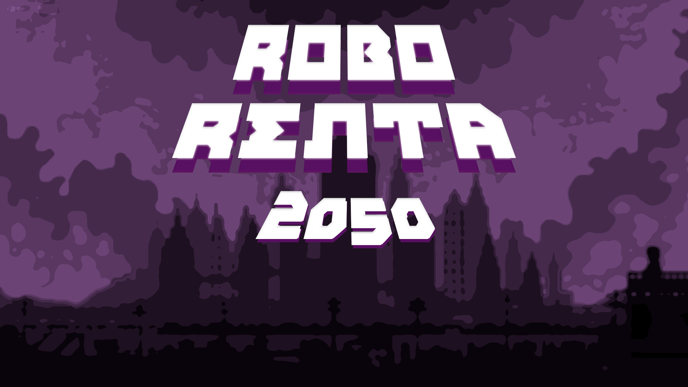

# Robo Renta 2050
Very small visual novel about rent prices in Madrid. Made for Madrid In Game's 6th Hack Jam, in november/december 2024.

https://haiqu.itch.io/robo-renta-2050

Made with love by Grupo 5.

## Sinopsis

Robo Renta 2050 es una novela visual con elementos de investigación que combina estética de corte retro con sátira.  Si eres propietario de un piso ¡hurra! Esta es tu oportunidad de oro para  ofrecer ese hermoso loft que dejaste en el olvido en nuestras manos. Nuestro último invento Arrendabot se encargará de todo, y digo TODO, lo necesario para sacar el máximo partido al alquilar tu hogar. Son DÉCADAS de una alta demanda de la vivienda en Madrid, ¿a qué esperas para aprovechar esta inversión? No muevas ni un dedo y Arrendabot se encargará de ser tu inmobiliario personal.

----

Estamos en el año 2050, ciudad Madrid. Por motivos laborales he tenido que mudarme, pero solo he pasado un infierno al encontrar un alquiler. Cientos de requisitos, precios fuera de la estratósfera, pisos en estado lamentable, y ubicaciones para nada accesibles.  Tengo pocos días para resolver esto o me quedaré bajo un puente. ¿Realmente qué debe hacer un ciudadano de a pie para poder conseguir un hogar en estas circunstancias?

Hoy tengo mi última cita de la semana para ver un piso con ... Arrendabot a secas? Espero que esta vez sea mi día de suerte.

_____________________________________

### Características

Aventura gráfica con 'point and click' que recuerda a juegos clásicos.
Esta demo se puede jugar en apróximadamente 5-10 minutos.

### Controles

Ratón.

### Créditos

- **Art** by [haiqu](https://haiqu.itch.io/)

- **Music** by aluengocm

- **Programmed** by [fmoran-m](https://fmoran-m.itch.io), [ProfesorMora](https://profesormora.itch.io/)

- **Game Design and script** by Caetano Arancibia